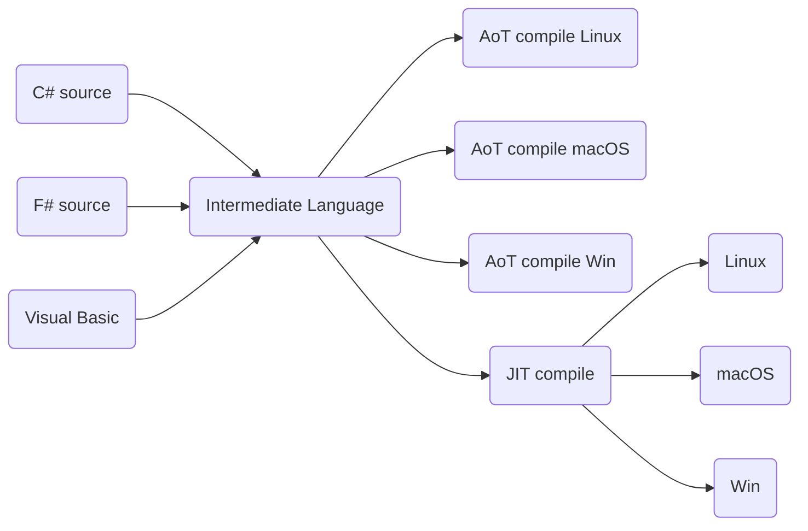

1. Why can a programmer use different languages, for example, C# and F#, to write applications that run on .NET Core?  

  * Page 14. All source code language is converted to a common assembler type code, **Intermediate Language (IL) **, in a DLL or EXE file. The .NET Core virtual machine, known as CoreCLR (Common Language Runtime), shares the same assembler code.  




```markdown

```
